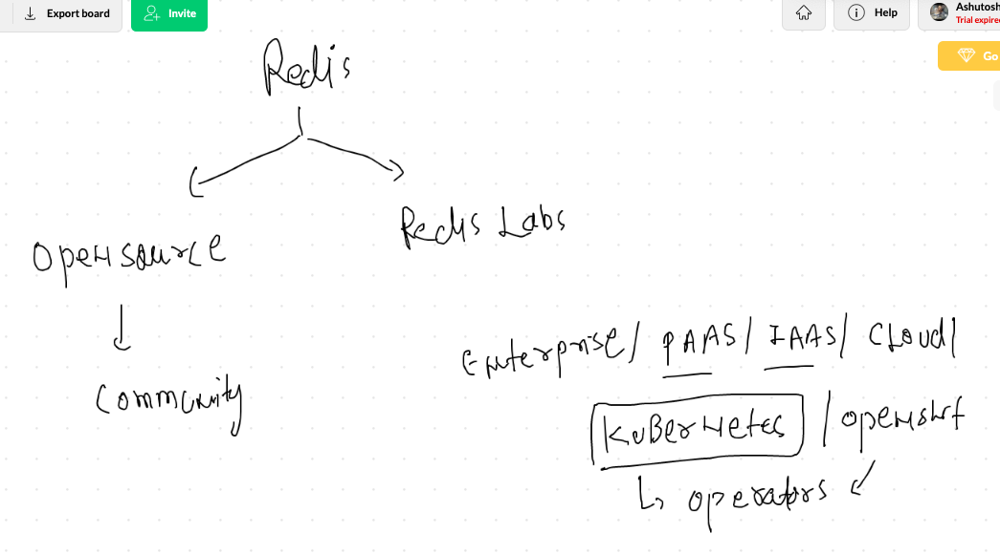
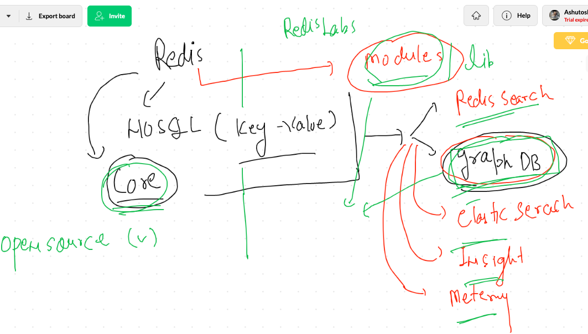
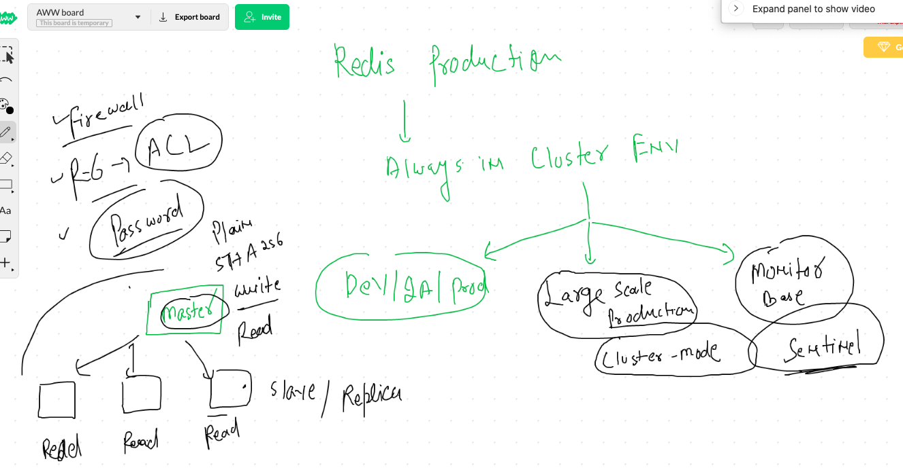
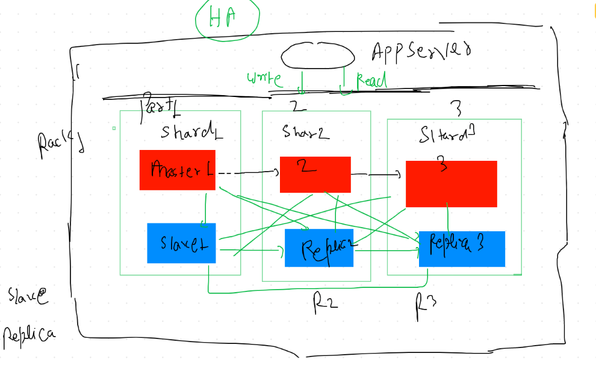

# REdis final day

## Comparasion b/w Redis 3.x & Redis 6.x 

<b> Labs are based out of RHEL 7.0 / 7.5 / 7.6 / 8.X  </b>

### Rhel 7.0 --->Redis 3.x  will be fine 
### RHEl 7.5+ / 8.x ---> Redis 6.x  will be fine 

# Redis offerings 



## Redis modules and core product



# Redis cluster status

<ul>
  <li> general cluster  </li>
  <li> Cluster with Master Node HA  </li>
  <li> CLuster with sentinal </li>
  
 </ul>
 
 ## General cluster 
 
 
 
 ## CLuster with master Node HA 
 
 
 
# CLuster setup

## Steps to perform in all Nodes 

### change bind address
```
bind 0.0.0.0
```

### protected mode no
```
protected-mode no
```

### cluster enable yes 

```
cluster-enabled yes
```

### cluster config 

```
cluster-config-file nodes-6379.conf 
```

### Node timeout value

```
cluster-node-timeout 15000
```

### enable AOF

```
appendonly yes
```

### start redis service
```
systemctl start redis
systemctl enable redis
```


## Now from any of the Node you want to configure as Master Hit this command from There 

```
[root@ip-172-31-66-52 ~]# redis-cli  --cluster create  172.31.66.52:6379  172.31.66.219:6379  172.31.73.40:6379   172.31.66.189:6379  172.31.73.247:6379  172.31.76.78:6379  --cluster-replicas 1 
>>> Performing hash slots allocation on 6 nodes...
Master[0] -> Slots 0 - 5460
Master[1] -> Slots 5461 - 10922
Master[2] -> Slots 10923 - 16383
Adding replica 172.31.73.247:6379 to 172.31.66.52:6379
Adding replica 172.31.76.78:6379 to 172.31.66.219:6379
Adding replica 172.31.66.189:6379 to 172.31.73.40:6379
M: 402a42de17f965b71ac6bf6d582c74c642be9179 172.31.66.52:6379
   slots:[0-5460] (5461 slots) master
M: abe130a3866404465420b2cb01a4a97780953401 172.31.66.219:6379
   slots:[5461-10922] (5462 slots) master
M: cdbaa05a23eef98f191eeba216c0bfd5d6e28d44 172.31.73.40:6379
   slots:[10923-16383] (5461 slots) master
S: 2d2f08b10a65b31ac9e2459740f1dbbd1aa4ef0c 172.31.66.189:6379
   replicates cdbaa05a23eef98f191eeba216c0bfd5d6e28d44
S: ec1364d7f1694ee1c1892d3b6b09e0fe0496d237 172.31.73.247:6379
   replicates 402a42de17f965b71ac6bf6d582c74c642be9179
S: bc933f3e22a1a03d3cd8ba5f74f1a09c49c02fc6 172.31.76.78:6379
   replicates abe130a3866404465420b2cb01a4a97780953401
Can I set the above configuration? (type 'yes' to accept): yes
>>> Nodes configuration updated
>>> Assign a different config epoch to each node
>>> Sending CLUSTER MEET messages to join the cluster
Waiting for the cluster to join
.
>>> Performing Cluster Check (using node 172.31.66.52:6379)
M: 402a42de17f965b71ac6bf6d582c74c642be9179 172.31.66.52:6379
   slots:[0-5460] (5461 slots) master
   1 additional replica(s)
M: abe130a3866404465420b2cb01a4a97780953401 172.31.66.219:6379
   slots:[5461-10922] (5462 slots) master
   1 additional replica(s)
S: 2d2f08b10a65b31ac9e2459740f1dbbd1aa4ef0c 172.31.66.189:6379
   slots: (0 slots) slave
   replicates cdbaa05a23eef98f191eeba216c0bfd5d6e28d44
M: cdbaa05a23eef98f191eeba216c0bfd5d6e28d44 172.31.73.40:6379
   slots:[10923-16383] (5461 slots) master
   1 additional replica(s)
S: bc933f3e22a1a03d3cd8ba5f74f1a09c49c02fc6 172.31.76.78:6379
   slots: (0 slots) slave
   replicates abe130a3866404465420b2cb01a4a97780953401
S: ec1364d7f1694ee1c1892d3b6b09e0fe0496d237 172.31.73.247:6379
   slots: (0 slots) slave
   replicates 402a42de17f965b71ac6bf6d582c74c642be9179
[OK] All nodes agree about slots configuration.
>>> Check for open slots...
>>> Check slots coverage...
[OK] All 16384 slots covered.

```
